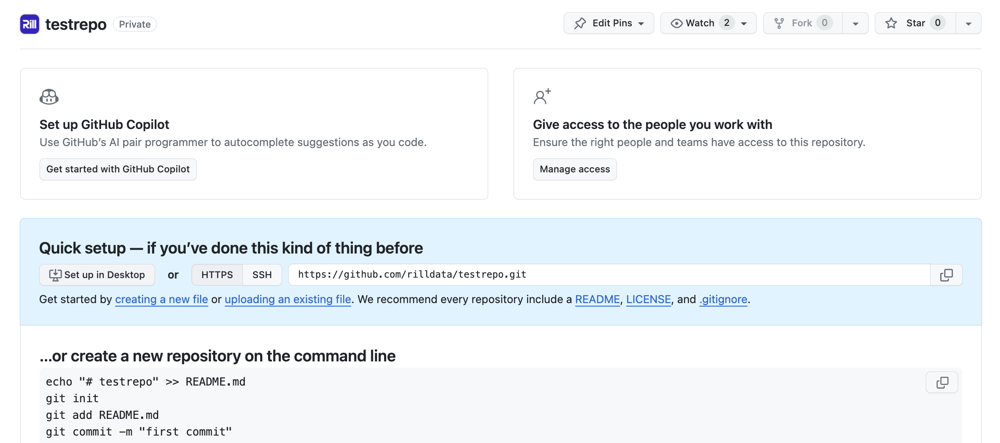
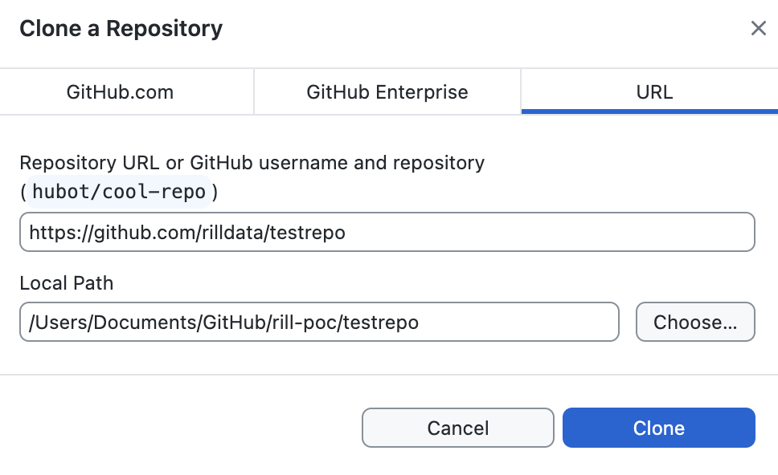
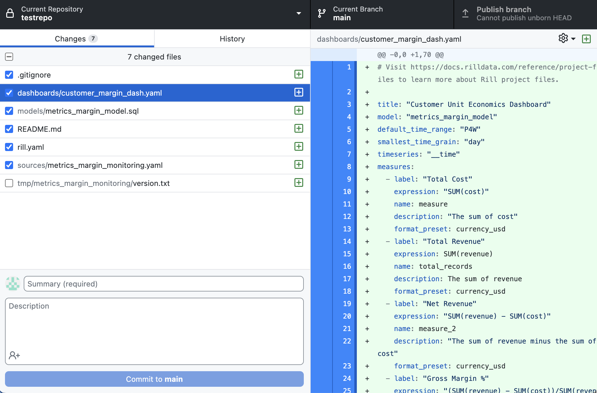

## Overview

To share dashboards with other users, Rill utilizes GitHub as a means of version control - effectively creating BI-as-code. There are several advantages to Git as the backend for dashboards: develop locally, integrate into existing development workflows, and manage versions + change control. While many users are familiar with Git and basic commands, there are other Rill users who are relatively new to Git. 

In this section, we will outline: 

- Installing the Git desktop app (recommended for those less familiar with Git vs. using the command line)
- Setting up your repository (repo) and cloning to your local
- Pushing changes to Git
- Deploying Rill to your new org to share dashboards, set up alerts and receive scheduled reports


## Installing Git

-To download the GitHub app, visit the [install site here](https://docs.github.com/en/desktop/installing-and-authenticating-to-github-desktop/installing-github-desktop).
- In your computer's Downloads folder, double-click the GitHub Desktop zip file.
- After the file has been unzipped, double-click the GitHub Desktop application file.
- GitHub Desktop will launch after installation is complete.

:::note Creating a GitHub account
If you do not already have a GitHub account, you'll need to create one as part of this process. For those looking to deploy to a company repo, we would suggest requesting access to a specific repo where you can get started.
:::

## Cloning Locally

Once you have downloaded GitHub and connected your account, you'll be able to create a new repository. Think of the repository as a shared cloud drive for the configuration files (sources, models, dashboards) that power Rill.

- First, go to GitHub.com and create a new repository - clicking the ```New``` button on the homepage


- After you name your respository and click save, you'll see the option to ```Set up in Desktop```. This will open the GitHub desktop app directly to "clone" the repo to your local computer


- Select the folder on your computer where you'd like to build with Rill. Confirm the location you cloned for the next step.



- Open the Terminal and go to your local copy of the repo (e.g. the above would be ```cd Documents/GitHub/rill-poc/testrepo```)

- Run the Rill install command ```curl https://rill.sh | sh``` (or run ```rill start``` if you've already installed)

Now - any changes you make locally can be synced directly with your GitHub repo in one click! You can revisit our [build section](../../build/) for refreshers on connecting to new sources, modeling data, or building dashboards.

## Pushing Changes

After installing Rill and adding sources, your local project will now contain a variety of new files - source definitions for connectors, sql models for transformation and dashboards for analysis. GitHub automatically recognizes those files as new and you can now push those changes to your cloud repository.

- First, open the GitHub app and select your repo. You should now see a variety of new changes



- On the bottom left, you can describe the changes (or add something like "initial commit")
- Select the now blue "Commit to Main" button on the bottom left
- Click Publish Branch on the top right - and that's it. Any future changes would follow the same two steps - add a comment, commit and publish

:::warning Avoid Syncing Data Files
During the commit process, uncheck files you do not wish to sync to your cloud repo. In particular, if you were working with local data files those will now be in the repo including ```tmp``` files and/or sources (e.g. parquet files). GitHub has a limit on cloud storage so instead add that data to a [cloud location (s3, gcs, azure)](../../reference/connectors/connectors.md) to access via the internet
:::

:::tip Make small changes directly in github
For any larger changes, we would suggest developing locally to see the effects of that change. However, for smaller changes (add a simple metric, changing the name of a dimension, etc) some users prefer to edit directly inline on GitHub.com
:::

## Deploying Rill

Now your dashboards are fully synced to GitHub, version controled and available to be edited by others. To make the dashboard fully cloud-enabled, you can return the Terminal and run ```rill deploy```. With everything synced, you should now be able to create a new Org within Rill and push your dashboard to the cloud. Any future changes would automatically be present in the cloud dashboards once committed and new dashboards would appear automatically as well (no deploy command needed). More details on [deployment here](../existing-project/existing-project.md).

We know that utilizing Git may be new to some - please reach out with questions on our [Discord channel](https://bit.ly/3unvA05) or [send us a note](mailto:contact@rilldata.com) 