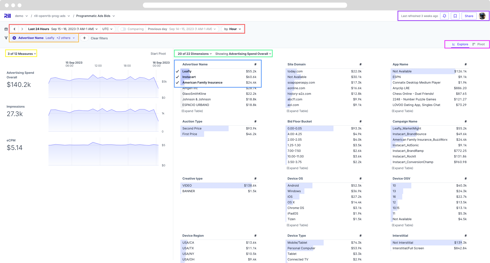

## Overview

Depending on whether you are opening Rill Developer or logging into Rill Cloud, you will either the default "Getting started" landing page or a list of all projects available to your user. For the purposes of this article, we will assume that your project has already been [deployed to Rill Cloud](../deploy/existing-project/existing-project.md) and that you are looking to consume your dashboards in a production capacity.

After logging into [Rill Cloud](https://ui.rilldata.com), you should see all projects within your [organization](../manage/project-management#organization) that is available and/or has been granted permissions to your user profile. Within each project, you'll then be able to access the corresponding individual dashboards that belong to a particular Rill project. 

This quickstart will call out the basic navigation and default key features that are available within each dashboard. The rest of the **Explore** section will cover some of the more advanced capabilities that are possible with using dashboards on Rill Cloud.

## Getting Started

The main screen of any Rill dashboard (referred to as _Explore_) is laid out with all metrics available in the underlying model on the left-hand side, broken out with summary numbers (e.g. BigNum) and timeseries visualizations (based on your configured `timeseries` column in your [dashboard YAML](/reference/project-files/dashboards.md)), and all dimensions available in the underlying model on the right-hand side via leaderboard / toplist charts. You can add or remove any metric and dimension from the page by simply selecting them from the dropdown above the charts (see `#1`). You can also drill into leaderboards further (see `#2`) to see all corresponding metrics for a specific dimension. Within that drilldown, you can also then sort by metric, search your dimensions, and/or [export data](exports.md). 

In terms of navigating around your dashboard, starting at the very top, you can change the period of analysis to different ranges of time (see `#3`), either by selecting from a pre-defined period (such as last week) or choosing a custom date range. Then, next to the time selector, you can set comparisons to analyze the prior period and/or to compare dimensions. Underneath the time selector, you'll also be able to find your filter bar (see `#4`) where you can [add filters](filters/filters.md) for metrics (e.g. all campaigns with more than 1000 impressions) or for dimensions (e.g. `campaign_name = Instacart`). Furthermore, if you prefer a more interactive exploration experience, you can directly filter the data in your dashboard by clicking any row in one of the right-side leaderboard charts, including drilling down to a specific leaderboard (where you can then toggle between include/exclude as filter options).

:::info Search for individual attributes

After drilling into a leaderboard (or what we sometimes refer to as a _toplist_ chart), rather than scrolling and finding an individual attribute (especially if the list is very long), you can also quickly search for a value and select / apply it to your dashboard by using the upper-right search box.

:::

Finally, you can also customize the default view of your dashboard (see `#5` above) to a predefined set of metrics, dimensions, and filters using our saved view functionality - otherwise known in Rill as [bookmarks](bookmarks.md). Bookmarks allow you as an end user to quickly save and return to your mostly commonly used dashboard applied states - keeping one overall dashboard that's shared with others but saving your most common analyses as needed. You can also share a dashboard with others by clicking on the `Share` button to send a direct link to any analysis.

:::tip Don't have a Rill project or dashboard deployed yet?

If you want to get hands on and see what interacting with a Rill dashboard feels like, we have a set of [demo projects](https://ui.rilldata.com/demo) already deployed on Rill Cloud and publicly available for everyone to try out. These [same projects](../home/get-started#example-projects) are also available on Github and can be deployed locally using Rill Developer.

:::

This is just the beginning and a quick basic 101 overview of interacting with any Rill dashboard! 

For more details about additional capabilities and/or how to utilize more advanced functionality within Rill dashboards, please see the [reference](#reference) section.

## Reference

- **[Filters & Comparisons](filters/filters.md)**
- **[Bookmarks & Sharing](bookmarks.md)**
- **[Exports & Scheduled Reports](exports.md)**
- **[Public URL](share-url.md)**
- **[Alerts](/explore/alerts/alerts.md)**
