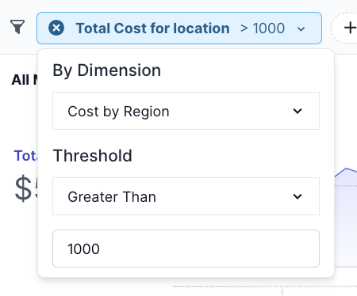
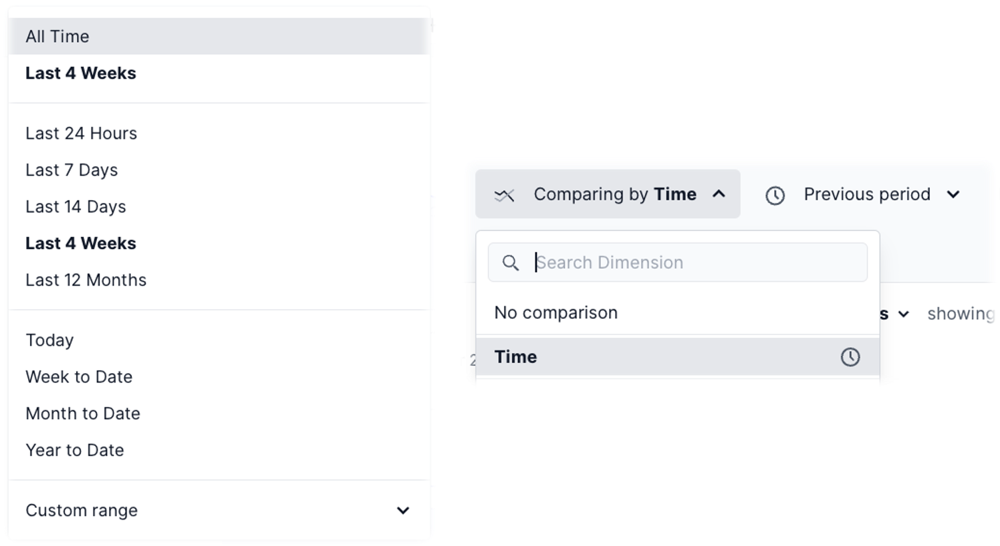

## Overview

Rill is particularly suited for exploratory analysis - to be able to slice & dice data quickly. As such, there are a variety of filter types and filter mechanisms throughout the app. The goal for each Rill dashboard is to provide users with as all metrics and dimensions required for each use case and create an interactive experience to cut data in any form.

### Filter by Dimensions

The primary/easiest way to filter data is by selecting values in the dimension tables. Leaderboards within Rill are fully interactive. Selecting any dimension in the table will automatically filter the remaining leaderboards and metrics by that selection. 

To add or remove dimensions on the page - select the All Dimensions picker above the Leaderboards. 

Next to the All Dimensions picker, you can also change which Metric is being highlighted to be able to update the entire page and cycle through each dimension table sorted by each metric.

You can also expand each dimension table to see all metrics and full list of those dimensions. In the expanded Leaderboard, you can search for dimension values, select all values returned, or exclude values from the result. 

Any filter applied in the Leaderboard will also show up in the filter bar at next to the time picker. You can apply the same search capabilities and select features in the filter bar as well.

### Filter by Metrics

There are also use cases where you want to filter by the metric values returned. As an example - all customers over $1000 in revenue, all campaigns with at least 1 million impressions, all delivery locations with late times over 4%, etc. 

To add or remove metrics on the page - select the All Measures picker above the Time Series charts. 

These metric filters can be applied from the filter bar. To apply a metric filter:

- Select the metric you wish to filter by (e.g. Total Cost)
- Select which dimension to sort/key the metric by (e.g. Cost by Region)
- Select your Threshold Type (e.g. Great Than)
- Input your Threshold amount and Click Enter

:::tip
Metric filters are a good way to "sort" by two different metrics. First, apply your metric threshold. Then, sort by your metrics within the Leaderboard to do multi-metric sorting. 

As an example - to see most active enterprise customers - filter all customers with revenue greater than $1000 then sorted by number of users increased descending.
:::

### Time & Dimension Comparisons
Time comparison is a key feature of Rill and recommended to find insights quicker by highlighting differences between periods. 

To compare different periods, first select your time period for analysis - either a predefined period or a custom range in top left time picker.

After selecting that range, select Compare by Time - either defaulting to the same prior period or selecting a custom comparison period. 

:::note
Default and comparison periods can be configured in your dashboard file. Visit [Dashboard Reference](../reference/project-files/dashboards.md) for more details
:::

Once you have select a comparison period, the time series charts and leaderboards will update to show period over period differences - in absolute value or percent change. You can also sort leaderboards based on that comparison to identify largest movers and shakers in your data. 

:::tip
Rill provides different options for time period comparison - by time period or by selected hours. 

For the former, you can let data "fill in" by selecting time period options like last day, previous 7 days, last week. Use cases here would be for pacing reports or seeing data refresh during business hours. Empty periods will show 'no data.'

For the latter, you can compare the full period looking with options like last 24 hours vs. prior 24 hours. In this case, the time series will be fully complete, comparing up to the most recent period vs. the same hour/day/week in prior periods.  
:::

In addition to time comparisons, you can select multiple dimension values to compare trends of those specific data points. There are two options for turning on dimension comparison:

- Use the same top filter bar as the time comparison, instead selecting a dimension for comparison
- Select the comparison option on the top left of any leaderboard and select multiple dimensions

De-select the comparison option or clear the filter bar to remove your comparisons.

