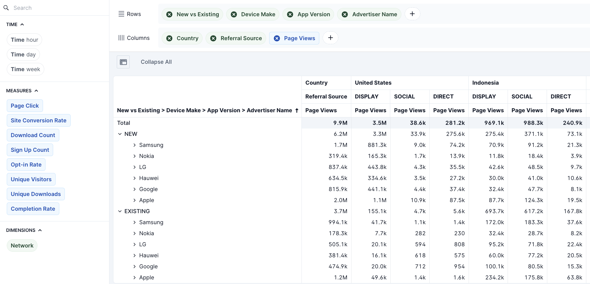

## Overview

Rill's multi-dimensional pivot provides lightning fast Excel style pivot tables across multiple dimensions, time granularities and metrics. The interface allows users to drag and drop any combination of fields for quick comparison and report generation. While the Explore view is great for data discovery, the Pivot view serves other use cases like:

- Regular reporting: Monthly financial reports, campaign reporting, client reports
- Time analysis: Dimensions by time columns for daily or weekly comparisons 
- Data export: Scheduled exports for generating csvs for external analysis (_coming soon_)

### Using Rill's Pivot View

Pivots can be split by time, measures and dimensions. You can drag and drop any of these options to rows and columns to create your pivot table (and can drag between columns/rows as well). Dimensions are also searchable in the top left or select the ```+``` to see the dimension list. As each dimension is added, you can track the kernels on the top left to see which rows have been added to the table. Each column dimesion will also be visuaized in the pivot. Like Time Dimension Detail, the same filter bar can be used to filter the pivot table overall. 



:::note Measures as splits
Measures can only be used as columns splits to define which metric is to be used in the table and cannot be added to the rows filter
:::

As new dimenions are added to the table, the comparison will aggregated by default and can be exanded as you navigate the table. Pivot tables can then be scrolled through to quickly navigate the row/column combinations. If a given split does not have any valid data, ```no data``` will be displayed in the cell. Select the window button on the top left of the pivot table to expand the view to full screen. To quickly reset all the expanded rows in the pivot table, you can select collapse all in the top left. 


